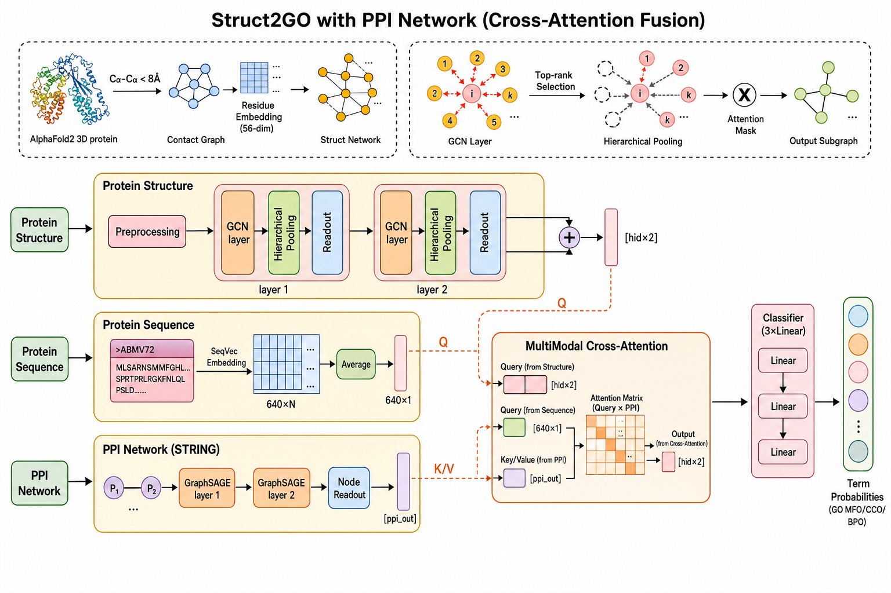

# ESM-AlphaFold-GO

Mô hình dự đoán chức năng protein (Gene Ontology) kết hợp **3 nguồn thông tin**:

| Nhánh | Dữ liệu đầu vào | Mạng xử lý |
|---|---|---|
| Cấu trúc protein | Contact map từ AlphaFold2 PDB | GCN + SAGPool (Hierarchical) |
| Trình tự protein | `seq.fasta` → ESM-2 / SeqVec 640-dim | Average pooling |
| Mạng tương tác PPI | `ppi.txt` (STRING) → GraphSAGE | PPIEncoder (2 lớp) + **Cross-Attention** fusion |

Đầu ra: xác suất cho từng GO term thuộc 3 nhánh **MFO** (308 term), **CCO** (310 term), **BPO** (713 term).

---

## Mục lục

1. [Cấu trúc thư mục và dữ liệu](#1-cấu-trúc-thư-mục-và-dữ-liệu)
2. [Cài đặt môi trường](#2-cài-đặt-môi-trường)
3. [Pipeline xử lý dữ liệu — chi tiết từng script](#3-pipeline-xử-lý-dữ-liệu--chi-tiết-từng-script)
4. [Huấn luyện (local & Kaggle)](#4-huấn-luyện-local--kaggle)
5. [Đánh giá](#5-đánh-giá)
6. [Kiến trúc model](#6-kiến-trúc-model)
7. [Xử lý sự cố](#7-xử-lý-sự-cố)
8. [Huấn luyện trên Kaggle T4 (chi tiết)](#8-huấn-luyện-trên-kaggle-t4-chi-tiết)

---

## 1. Cấu trúc thư mục và dữ liệu

### Dữ liệu thô (cần có sẵn trước khi chạy)

```
D:\raw_data\
├── struct_feature\                          ← Thư mục chứa file cấu trúc AlphaFold2
│   ├── AF-A0A0A0MRZ7-F1-model_v6.pdb.gz   ← File PDB nén (dùng để xây contact map)
│   ├── AF-A0A0A0MRZ7-F1-model_v6.cif.gz   ← File CIF nén (không dùng trong pipeline)
│   ├── AF-A0A0A0MRZ8-F1-model_v6.pdb.gz
│   └── ...  (mỗi protein có 1 cặp .pdb.gz + .cif.gz)
│
├── goa_human.gaf.gz    ← GO annotation của human proteome (từ UniProt GOA)
├── ppi.txt             ← PPI network (định dạng STRING: protein1 protein2 score)
└── seq.fasta           ← Trình tự protein (định dạng FASTA, UniProt ID)
```

> **Tên file PDB:** Pattern `AF-{UniProtID}-F1-model_v6.pdb.gz`.
> Script lấy UniProtID bằng cách tách `-` tại vị trí thứ 2: `filename.split('-')[1]`.

### Thư mục dự án

```
D:\CAFA6\
├── data_processing\
│   ├── 1_get_valid_ids.py              ← Bước 1: lấy danh sách protein ID hợp lệ
│   ├── go_anno.py                      ← Bước 2: parse GO annotation → JSON
│   ├── 2_extract_struct_map.py         ← Bước 3: PDB.gz → contact map edge list  ✓ DÙNG CÁI NÀY
│   ├── predicted_protein_struct2map.py ← (script cũ, path Linux, không dùng)
│   ├── get_sequence.py                 ← Bước 4a: PDB → one-hot sequence (26-dim)
│   ├── seq2vec.py                      ← Bước 4b: FASTA → SeqVec embedding (1024-dim)
│   ├── read_seqvec_features.py         ← Bước 4c: chuẩn hóa SeqVec → dict pickle
│   ├── 3_uniprot_mapping.py            ← Bước 5: ENSP ID trong ppi.txt → UniProtKB AC
│   ├── 4_build_ppi_graph.py            ← Bước 6: xây PPI global DGL graph
│   ├── 3_build_graph_dataset.py        ← Bước 7: ghép tất cả → dataset pickle
│   ├── divide_data.py                  ← Bước 8: chia train/valid/test
│   └── sort.py                         ← (tiện ích sắp xếp edge file, dùng nếu cần)
│
├── model\
│   ├── network.py    ← SAGNetworkHierarchical + PPIEncoder
│   ├── layer.py      ← ConvPoolBlock, SAGPool
│   ├── evaluation.py ← calculate_performance, cacul_aupr
│   └── utils.py
│
├── train_Struct2GO2.py   ← Script huấn luyện chính (--kaggle cho T4)
├── eval_Struct2GO2.py    ← Script đánh giá / xuất kết quả
├── pack_for_kaggle.py    ← Đóng gói dataset upload Kaggle
├── kaggle_notebook.md    ← Template notebook Kaggle (copy từng cell)
├── model.png             ← Sơ đồ kiến trúc gốc (2 nhánh)
├── model_with_ppi.png    ← Sơ đồ đầy đủ (3 nhánh + Cross-Attention)
│
├── proceed_data\         ← Dữ liệu đã xử lý (tự động tạo)
├── divided_data\         ← Dataset chia train/valid/test (tự động tạo)
├── save_models\          ← Model checkpoint (tự động tạo)
├── log\                  ← Training log (tự động tạo)
└── test_result\          ← Kết quả đánh giá (tự động tạo)
```

### Sơ đồ luồng dữ liệu tổng quan

```
D:\raw_data\struct_feature\*.pdb.gz
    │ Bước 1                    │ Bước 3
    ▼                           ▼
proceed_data\             proceed_data\
valid_protein_ids.csv     proteins_edges\{ID}.txt  (contact map edges)
                                    │
D:\raw_data\goa_human.gaf.gz        │
    │ Bước 2                        │
    ▼                               │
proceed_data\human_{BP/MF/CC}_ACS.json
                                    │
D:\raw_data\seq.fasta               │
    │ Bước 4                        │
    ▼                               │
proceed_data\dict_sequence_feature  │  (SeqVec 1024-dim)
proceed_data\protein_node2onehot    │  (one-hot 26-dim per residue)
                                    │
D:\raw_data\ppi.txt                 │
    │ Bước 5                        │
    ▼                               │
proceed_data\uniprot_ensembl_mapping.csv
    │ Bước 6                        │
    ▼                               │
proceed_data\ppi_graph_global  ◄────┤
proceed_data\ppi_protein_index      │
                                    │ Bước 7
                                    ▼
                    proceed_data\emb_graph_{ns}
                    proceed_data\emb_seq_feature_{ns}
                    proceed_data\emb_label_{ns}
                    proceed_data\emb_ppi_node_id_{ns}
                                    │ Bước 8
                                    ▼
                    divided_data\{ns}_{train/valid/test}_dataset
                                    │
                             Train  ▼  Eval
                    save_models\bestmodel_*.pkl
```

---

## 2. Cài đặt môi trường

### Yêu cầu hệ thống

- Python 3.10+
- CUDA GPU (khuyến nghị; CPU chạy được nhưng rất chậm)
- RAM ≥ 32 GB

### Tạo môi trường conda

```bash
conda env create -f environment.yml
conda activate cafa6
```

### Hoặc cài thủ công qua pip

```bash
pip install torch torchvision torchaudio --index-url https://download.pytorch.org/whl/cu118
pip install dgl -f https://data.dgl.ai/wheels/cu118/repo.html
pip install biopython scipy scikit-learn transformers tqdm pandas requests
```

### Kiểm tra

```python
import torch, dgl
print(torch.__version__)          # >= 2.0
print(dgl.__version__)            # >= 1.1
print(torch.cuda.is_available())  # True nếu có GPU
```

---

## 3. Pipeline xử lý dữ liệu — chi tiết từng script

Chạy **đúng thứ tự** từ Bước 1 đến Bước 8. Tạo thư mục output trước:

```bash
mkdir D:\CAFA6\proceed_data
mkdir D:\CAFA6\divided_data
mkdir D:\CAFA6\save_models
mkdir D:\CAFA6\log
mkdir D:\CAFA6\test_result
```

### Checklist nhanh (theo thứ tự)

| Bước | Script | Output chính | Thời gian ước tính |
|:---:|---|---|:---:|
| 1 | `1_get_valid_ids.py` | `valid_protein_ids.csv` | vài phút |
| 2 | `go_anno.py` | `HUMAN_protein_info.json` | 5–15 phút |
| 3 | `2_extract_struct_map.py` | `proteins_edges/*.txt` | vài giờ (tùy số PDB) |
| 4a | `get_sequence.py` | `protein_node2onehot` | vài giờ |
| 4b | `seq2vec.py` hoặc ESM-2 | `9606-avg-emb.pkl` | vài giờ |
| 4c | `read_seqvec_features.py` | `dict_sequence_feature` | vài phút |
| 5 | `3_uniprot_mapping.py` | `uniprot_ensembl_mapping.csv` | 10–30 phút |
| 6 | `4_build_ppi_graph.py` | `ppi_graph_global`, `ppi_protein_index` | 5–20 phút |
| 7 | `3_build_graph_dataset.py` | `emb_graph_*`, `emb_seq_feature_*`, … | 30–90 phút |
| 8 | `divide_data.py` | `divided_data/*_dataset` | vài phút |
| — | `pack_for_kaggle.py` (nếu lên Kaggle) | `kaggle_data.zip` | vài phút |
| Train | `train_Struct2GO2.py` | `save_models/bestmodel_*.pkl` | xem mục 4 / 8 |

---

### Bước 1 — Trích xuất danh sách protein ID hợp lệ

**Script:** `data_processing/1_get_valid_ids.py`

**Làm gì:** Quét toàn bộ file `*.pdb.gz` trong `D:\raw_data\struct_feature\`, trích xuất UniProt ID từ tên file theo pattern `AF-{UniProtID}-F1-model_v6.pdb.gz`, lưu danh sách ra CSV.

**Input:**
```
D:\raw_data\struct_feature\AF-*.pdb.gz
```

**Output:**
```
D:\CAFA6\proceed_data\valid_protein_ids.csv
    Protein_ID
    A0A0A0MRZ7
    A0A0A0MRZ8
    ...
```

**Chạy:**
```bash
cd D:\CAFA6
python data_processing/1_get_valid_ids.py
```

---

### Bước 2 — Parse GO annotation

**Script:** `data_processing/go_anno.py`

**Làm gì:** Đọc file `goa_human.gaf.gz`, parse từng dòng annotation (bỏ qua dòng comment bắt đầu bằng `!`), nhóm GO term theo protein ID (cột 2 = UniProt ID, cột 5 = GO term).

**⚠️ Sửa path trước khi chạy** — script hiện đọc từ `D:/CAFA6/goa_human.gaf.gz` nhưng file thực tế ở `D:/raw_data/`. Mở `go_anno.py` sửa dòng 4:

```python
# Sửa từ:
with gzip.open("D:/CAFA6/goa_human.gaf.gz", "rt") as f:
# Thành:
with gzip.open("D:/raw_data/goa_human.gaf.gz", "rt") as f:
```

**Input:**
```
D:\raw_data\goa_human.gaf.gz
```

**Output:**
```
D:\CAFA6\proceed_data\HUMAN_protein_info.json
    {"P12345": ["GO:0005515", "GO:0003677", ...], ...}
```

> **Lưu ý:** Output này chứa toàn bộ annotation chưa lọc theo nhánh. Bước 7 cần các file `human_BP_ACS.json`, `human_MF_ACS.json`, `human_CC_ACS.json` đã lọc theo nhánh GO và ngưỡng tần suất (loại bỏ GO term xuất hiện < N protein). Các file này cần được tạo từ `HUMAN_protein_info.json` kết hợp với `go.obo`.

**Chạy:**
```bash
python data_processing/go_anno.py
```

---

### Bước 3 — Xây dựng contact map từ file PDB.gz

**Script:** `data_processing/2_extract_struct_map.py`

**Làm gì:** Đọc trực tiếp từng file `.pdb.gz` (không cần giải nén ra ổ cứng), dùng BioPython để phân tích cấu trúc, tính khoảng cách Euclide giữa tất cả các nguyên tử **C-alpha**. Hai residue được nối bằng cạnh nếu khoảng cách < **8.0 Å**. Lưu danh sách cạnh thành file text.

**Input:**
```
D:\raw_data\struct_feature\AF-{UniProtID}-F1-model_v6.pdb.gz
```

**Output:**
```
D:\CAFA6\proceed_data\proteins_edges\{UniProtID}.txt
    0 5
    0 7
    1 2
    ...   (mỗi dòng: node_i node_j, không có header)
```

**Cấu hình** (đầu script, có thể thay đổi):
```python
STRUCT_DIR = Path("D:/raw_data/struct_feature")
OUTPUT_DIR = Path("D:/CAFA6/proceed_data/proteins_edges")
THRESHOLD  = 8.0   # Angstrom
```

**Chạy:**
```bash
python data_processing/2_extract_struct_map.py
```

> Script bỏ qua file đã xử lý (`if out_file.exists(): continue`) — có thể chạy lại an toàn nếu bị gián đoạn giữa chừng.

> **Đừng dùng `predicted_protein_struct2map.py`** — script cũ với path Linux cũ, đã thay bằng `2_extract_struct_map.py`.

---

### Bước 4 — Tạo node feature và sequence embedding

Bước này gồm **3 phần** tạo ra 3 loại feature khác nhau cho mỗi protein.

#### 4a — One-hot residue feature (26-dim per residue)

**Script:** `data_processing/get_sequence.py`

**Làm gì:** Đọc từng file PDB trong `struct_feature`, trích xuất chuỗi amino acid, mã hóa mỗi amino acid thành vector one-hot 26-dim (bảng ký tự 26 amino acid chuẩn + ký tự đặc biệt).

**⚠️ Script này cần sửa path** (hiện còn path Linux cũ). Các dòng cần sửa:

```python
# Dòng 46 — sửa path CSV (hoặc đọc từ valid_protein_ids.csv thay thế):
df = pd.read_csv("D:/CAFA6/proceed_data/valid_protein_ids.csv")

# Thêm vòng lặp duyệt đúng thư mục:
for path, dir_list, file_list in os.walk("D:/raw_data/struct_feature"):

# Dòng 59–61 — sửa path output:
with open('D:/CAFA6/proceed_data/protein_node2onehot', 'wb') as f:
    pickle.dump(protein_node2one_hot, f)
with open('D:/CAFA6/proceed_data/protein_sequence', 'wb') as f:
    pickle.dump(protein_sequence, f)
```

**Output:**
```
D:\CAFA6\proceed_data\protein_node2onehot   ← {UniProtID → ndarray(L, 26)}
D:\CAFA6\proceed_data\protein_sequence      ← {UniProtID → str}
```

#### 4b — SeqVec embedding (1024-dim per protein)

**Script:** `data_processing/seq2vec.py`

**Làm gì:** Dùng mô hình SeqVec (ELMo-based, pretrained trên UniRef) để encode toàn bộ chuỗi amino acid thành vector 1024-dim. Input là file FASTA `seq.fasta`, output là dict pickle.

**Input:**
```
D:\raw_data\seq.fasta
    >sp|P12345|PROT_HUMAN ...
    MKTAYIAKQRQISFVKSHFSRQLEERLGLIEVQAPILSRVGDGTQDNLSGAEK...
```

**Chạy:**
```bash
python data_processing/seq2vec.py \
    -i D:/raw_data/seq.fasta \
    -o D:/CAFA6/proceed_data/9606-avg-emb.pkl \
    --protein True
```

> `--protein True` → lấy trung bình theo chiều dài → output là Tensor(1024,) cho mỗi protein (không phải per-residue).

> **Thay bằng ESM-2** (khuyến nghị — chính xác hơn, không cần cài allennlp):
> ```python
> import esm, torch, pickle
> model, alphabet = esm.pretrained.esm2_t33_650M_UR50D()
> batch_converter = alphabet.get_batch_converter()
> # ... encode từng protein → mean pooling → {UniProtID: ndarray(1024,)}
> # Lưu: pickle.dump(result, open('D:/CAFA6/proceed_data/9606-avg-emb.pkl','wb'))
> ```

#### 4c — Chuẩn hóa SeqVec vào dict

**Script:** `data_processing/read_seqvec_features.py`

**Làm gì:** Đọc file embedding từ bước 4b, chỉ giữ protein có trong `valid_protein_ids.csv`, lưu thành dict pickle chuẩn dùng ở bước 7.

**⚠️ Sửa path** trong script (hiện còn path Linux):

```python
# Sửa:
with open('D:/CAFA6/proceed_data/9606-avg-emb.pkl', 'rb') as f:
    sequence_feature = pickle.load(f)

df = pd.read_csv("D:/CAFA6/proceed_data/valid_protein_ids.csv")
# lấy list protein_id từ df...

with open('D:/CAFA6/proceed_data/dict_sequence_feature', 'wb') as f:
    pickle.dump(dict_sequence_feature, f)
```

**Output:**
```
D:\CAFA6\proceed_data\dict_sequence_feature   ← {UniProtID → list(1024,)}
```

---

### Bước 5 — Map ENSP ID trong ppi.txt → UniProtKB AC

**Script:** `data_processing/3_uniprot_mapping.py`

**Làm gì:** File `ppi.txt` dùng định dạng STRING với protein ID dạng `9606.ENSP00000...`. Script trích xuất tất cả ENSP ID duy nhất từ 2 cột đầu, gửi batch 500 ID lên UniProt REST API để chuyển đổi sang UniProtKB Accession (dạng `P12345`). Kết quả lưu thành CSV.

**Input:**
```
D:\raw_data\ppi.txt
    protein1                  protein2                  combined_score
    9606.ENSP00000000233      9606.ENSP00000020405      490
    9606.ENSP00000000412      9606.ENSP00000379496      688
    ...
```

**Output:**
```
D:\CAFA6\proceed_data\uniprot_ensembl_mapping.csv
    UniProtKB_AC,Ensembl_Protein
    P12345,ENSP00000000233
    Q67890,ENSP00000020405
    ...
```

**Chạy:**
```bash
python data_processing/3_uniprot_mapping.py
```

> Path `D:\raw_data\ppi.txt` đã được cấu hình sẵn là `DEFAULT_INPUT_FILE` trong script — không cần sửa.

> Quá trình gọi API có thể mất **10–30 phút** tùy số lượng ENSP ID. Script tự retry khi gặp lỗi mạng (HTTP 429/503).

---

### Bước 6 — Xây dựng PPI global graph

**Script:** `data_processing/4_build_ppi_graph.py`

**Làm gì:** Lọc cạnh PPI có `combined_score ≥ 700`, map ENSP → UniProt (dùng CSV từ bước 5), chỉ giữ protein có trong GO annotation. Xây `dgl.DGLGraph` toàn cục: node = protein, edge = PPI interaction (vô hướng). Gắn 1024-dim sequence embedding làm node feature ban đầu.

**⚠️ Sửa tên file PPI** trong script (dòng 34) — hiện trỏ đến `9606.protein.links.v12.0.txt` nhưng file thực là `ppi.txt`:

```python
# Dòng 34 — sửa thành:
STRING_FILE = RAW_DIR / "ppi.txt"
```

**Input:**
```
D:\raw_data\ppi.txt                               (từ bước 5 đã map)
D:\CAFA6\proceed_data\uniprot_ensembl_mapping.csv
D:\CAFA6\proceed_data\human_BP_ACS.json           (lọc protein hợp lệ)
D:\CAFA6\proceed_data\dict_sequence_feature       (node feature ban đầu)
```

**Output:**
```
D:\CAFA6\proceed_data\ppi_graph_global
    dgl.DGLGraph — ndata["feat"]: Tensor(N, 1024)
    N ≈ số protein có trong tập GO + PPI

D:\CAFA6\proceed_data\ppi_protein_index
    {UniProtKB_AC → node_id (int)}
```

**Chạy:**
```bash
python data_processing/4_build_ppi_graph.py
```

> **Tuỳ chỉnh ngưỡng score** (dòng 43):
> ```python
> PPI_SCORE_THRESHOLD = 700   # 400=medium | 700=high | 900=very high
> ```

---

### Bước 7 — Ghép tất cả thành graph dataset

**Script:** `data_processing/3_build_graph_dataset.py`

**Làm gì:** Với mỗi nhánh GO (bp/mf/cc), duyệt qua từng protein có annotation, kết hợp:
- Contact map edges → `dgl.DGLGraph` với node feature
- Sequence feature 1024-dim
- GO label vector (multi-hot)
- PPI node index (vị trí trong PPI global graph)

Lưu thành 4 dict pickle per nhánh.

**⚠️ Cấu hình `NODE_FEAT_MODE`** (dòng 52):
```python
NODE_FEAT_MODE = "concat"
# "node2vec" → 30-dim, chỉ dùng protein_node2vec
# "onehot"   → 26-dim, chỉ dùng protein_node2onehot
# "concat"   → 56-dim = node2vec(30) + onehot(26)  ← KHUYẾN NGHỊ
```

Dùng `"concat"` (56-dim) để khớp với `train_Struct2GO2.py` (khai báo `in_dim=56`).

**Input:**
```
D:\CAFA6\proceed_data\proteins_edges\*.txt      (bước 3)
D:\CAFA6\proceed_data\protein_node2vec          (nếu có, 30-dim)
D:\CAFA6\proceed_data\protein_node2onehot       (bước 4a, 26-dim)
D:\CAFA6\proceed_data\dict_sequence_feature     (bước 4c, 1024-dim)
D:\CAFA6\proceed_data\ppi_protein_index         (bước 6)
D:\CAFA6\proceed_data\human_{BP/MF/CC}_ACS.json (bước 2)
```

**Output (tạo cho cả 3 nhánh bp / mf / cc):**

| File | Nội dung | Shape |
|---|---|---|
| `emb_graph_{ns}` | `{ID → dgl.DGLGraph}` contact map + node feature | nodes: L residues |
| `emb_seq_feature_{ns}` | `{ID → Tensor}` sequence embedding | (1024,) |
| `emb_label_{ns}` | `{ID → Tensor}` multi-hot GO label | (num_labels,) |
| `emb_ppi_node_id_{ns}` | `{ID → int}` node index PPI graph | scalar, -1 nếu absent |
| `label_vocab_{ns}.json` | `[GO_term_0, ...]` | list |
| `label_{ns}_network` | `dgl.DGLGraph` co-occurrence GO label | — |

**Chạy:**
```bash
python data_processing/3_build_graph_dataset.py
```

---

### Bước 8 — Chia train / valid / test

**Script:** `data_processing/divide_data.py`

**Làm gì:** Đọc dataset từ bước 7, chia ngẫu nhiên theo tỷ lệ **70% / 20% / 10%**, lưu thành 3 file pickle riêng cho mỗi nhánh. Mỗi sample là tuple `(protein_id, struct_graph, label, seq_feature, ppi_node_id)`.

**Input:**
```
D:\CAFA6\proceed_data\emb_graph_{ns}
D:\CAFA6\proceed_data\emb_seq_feature_{ns}
D:\CAFA6\proceed_data\emb_label_{ns}
D:\CAFA6\proceed_data\emb_ppi_node_id_{ns}
```

**Output:**
```
D:\CAFA6\divided_data\{ns}_train_dataset
D:\CAFA6\divided_data\{ns}_valid_dataset
D:\CAFA6\divided_data\{ns}_test_dataset
```

**Chạy:**
```bash
python data_processing/divide_data.py
```

---

## 4. Huấn luyện (local & Kaggle)

Script `train_Struct2GO2.py` tự đọc đường dẫn qua biến môi trường `DATA_DIR` (mặc định `D:/CAFA6`). Không cần sửa path trong code.

### 4.1 Điều kiện tiên quyết

Hoàn thành **Bước 1–8** (mục 3) và kiểm tra các file sau tồn tại:

```
proceed_data/ppi_graph_global
proceed_data/ppi_protein_index
proceed_data/label_{bp,mf,cc}_network
divided_data/{bp,mf,cc}_{train,valid,test}_dataset
```

### 4.2 Huấn luyện trên máy local (Windows / Linux)

**CPU (Windows, DGL không có CUDA):**
```bash
cd D:\CAFA6
python train_Struct2GO2.py -branch mf -batch_size 32 -epochs 10 --cpu
```

**GPU local (Linux / WSL, đã cài DGL CUDA):**
```bash
export DGL_CUDA=1
export DATA_DIR=D:/CAFA6
python train_Struct2GO2.py -branch mf -batch_size 64 --amp
```

**Cả 3 nhánh GO:**
```bash
python train_Struct2GO2.py -branch mf -dropout 0.2
python train_Struct2GO2.py -branch cc -dropout 0.2
python train_Struct2GO2.py -branch bp  -dropout 0.1
```

> `labels_num` được **tự phát hiện** từ dataset — không cần truyền tay nếu data đã build đúng.

### 4.3 Preset Kaggle T4 (khuyến nghị)

```bash
DGL_CUDA=1 DATA_DIR=/kaggle/working/CAFA6 python train_Struct2GO2.py \
    -branch mf --kaggle
```

Preset `--kaggle` bật sẵn:

| Tối ưu | Giá trị |
|---|---|
| `batch_size` | 96 |
| `hid_dim` / `num_convs` | 384 / 4 |
| Mixed precision (`--amp`) | Bật |
| Cache PPI graph / epoch | Bật (tránh chạy GraphSAGE mỗi batch) |
| `epochs` | 20 |
| `num_workers` | 2 |

Xem hướng dẫn đầy đủ từng bước upload data → notebook tại [mục 8](#8-huấn-luyện-trên-kaggle-t4-chi-tiết).

### 4.4 Tham số CLI

| Tham số | Mô tả | Mặc định |
|---|---|---|
| `-branch` | Nhánh GO: `bp`, `mf`, `cc` | `mf` |
| `-batch_size` | Batch size | `64` |
| `-learningrate` | Learning rate (AdamW) | `1e-4` |
| `-dropout` | Dropout | `0.3` |
| `-epochs` | Số epoch | `10` |
| `-hid_dim` | Hidden dim GCN / attention | `256` |
| `-num_convs` | Số ConvPoolBlock | `3` |
| `-seq_dim` | Chiều embedding sequence (auto-detect từ data) | `640` |
| `-ppi_out_dim` | Chiều đầu ra PPIEncoder | `128` |
| `-num_workers` | DataLoader workers | `4` |
| `-validate_every` | Validate mỗi N epoch | `4` |
| `--amp` | FP16 mixed precision (T4) | Tắt |
| `--cache_ppi` | Encode PPI graph 1 lần/epoch | Bật |
| `--cpu` | Bắt buộc CPU | Tắt |
| `--kaggle` | Preset T4 (bảng trên) | Tắt |

**Log & checkpoint:**
```
log/{branch}.log
save_models/bestmodel_{branch}_{batch}_{lr}_{dropout}.pkl
```

```bash
# Linux / Kaggle
tail -f log/mf.log
```

---

## 5. Đánh giá

Dùng `DATA_DIR` và đường dẫn model tương ứng checkpoint sau train:

```bash
set DATA_DIR=D:\CAFA6
python eval_Struct2GO2.py -branch mf -thresh 0.71 ^
    -model_path save_models/bestmodel_mf_96_0.0001_0.2.pkl

python eval_Struct2GO2.py -branch cc -thresh 0.50
python eval_Struct2GO2.py -branch bp  -thresh 0.40
```

| Output | Nội dung |
|---|---|
| `test_result/{branch}_result.json` | GO term mới dự đoán cho từng protein |
| `test_result/{branch}_roc_curve.png` | Biểu đồ ROC |
| `log/test_{branch}.log` | F-max, AUC, AUPR, Precision, Recall |

---

## 6. Kiến trúc model

Sơ đồ chi tiết (phong cách paper, 3 nhánh + Cross-Attention):



**Luồng xử lý:**

1. **Protein Structure** — contact map (AlphaFold PDB, Cα < 8Å) → `ConvPoolBlock` × N (GCN + SAGPool + Readout) → vector `[hid×2]`.
2. **Protein Sequence** — ESM-2 / SeqVec → Average pooling → `[seq_dim]` (640).
3. **PPI Network** — STRING `ppi.txt` → `PPIEncoder` (GraphSAGE × 2) → `[ppi_out]`.
4. **Fusion** — `MultiModalCrossAttention`: struct + seq là **Query**, PPI là **Key/Value** → `[hid×2]`.
5. **Classifier** — Linear × 3 → xác suất GO term (MFO / CCO / BPO).

| Thành phần | Local mặc định | Preset `--kaggle` (T4) |
|---|---|---|
| `in_dim` (residue feature) | 56 = onehot(26) + node2vec(30) | 56 |
| `hid_dim` | 256 | 384 |
| `num_convs` | 3 | 4 |
| `pool_ratio` | 0.5 | 0.5 |
| `seq_dim` / `ppi_in_dim` | 640 (ESM-2 150M) | auto từ data |
| `ppi_out_dim` | 128 | 128 |
| Fusion PPI | Cross-attention (4 heads) | Cross-attention |
| Tối ưu train | `--cache_ppi` | `--amp` + `--cache_ppi` |

---

## 7. Xử lý sự cố

### Tổng hợp path cần sửa trong các script

| Script | Vấn đề | Sửa thành |
|---|---|---|
| `go_anno.py` dòng 4 | Path GAF sai | `"D:/raw_data/goa_human.gaf.gz"` |
| `4_build_ppi_graph.py` dòng 34 | Tên file PPI sai | `RAW_DIR / "ppi.txt"` |
| `read_seqvec_features.py` | Path Linux cũ | Tất cả path → `D:/CAFA6/...` |
| `get_sequence.py` | Path Linux cũ | Tất cả path → `D:/CAFA6/...` |
| `train_Struct2GO2.py` | Path | Dùng env `DATA_DIR` (không sửa code) |
| `eval_Struct2GO2.py` | Path | Dùng env `DATA_DIR` + `-model_path` |

### Lỗi thường gặp

**`FileNotFoundError: ppi_graph_global`**
```
Chưa chạy bước 6: python data_processing/4_build_ppi_graph.py
```

**`FileNotFoundError: uniprot_ensembl_mapping.csv`**
```
Chưa chạy bước 5: python data_processing/3_uniprot_mapping.py
```

**Dimension mismatch trong model**
```
NODE_FEAT_MODE trong 3_build_graph_dataset.py phải khớp với in_dim:
  "concat"   (56-dim) → train_Struct2GO2.py (in_dim=56)  ← dùng cái này
  "node2vec" (30-dim) → train_Struct2GO.py  (in_dim=30)
```

**`CUDA out of memory` (Kaggle T4 16GB)**
```bash
# Giảm batch hoặc model
python train_Struct2GO2.py -branch mf --kaggle -batch_size 64
python train_Struct2GO2.py -branch mf -hid_dim 256 -num_convs 3 -batch_size 48
```

**DGL không nhận CUDA trên Windows**
```
Dùng --cpu hoặc train trên Kaggle/Linux với DGL_CUDA=1
```

**Nhiều protein bị skip ở bước 7**
```
Kiểm tra bước 3 đã chạy đủ chưa:
  dir D:\CAFA6\proceed_data\proteins_edges | find /c ".txt"
Số file .txt nên xấp xỉ số file .pdb.gz trong struct_feature.
```

**UniProt API timeout (bước 5)**
```
Script tự retry. Nếu vẫn lỗi: giảm BATCH_SIZE = 200 trong 3_uniprot_mapping.py
```

### Thứ tự chạy đầy đủ

```bash
python data_processing/1_get_valid_ids.py
python data_processing/go_anno.py
python data_processing/2_extract_struct_map.py
python data_processing/get_sequence.py
python data_processing/seq2vec.py -i D:/raw_data/seq.fasta -o D:/CAFA6/proceed_data/9606-avg-emb.pkl --model 150M --batch_size 4
python data_processing/read_seqvec_features.py
python data_processing/3_uniprot_mapping.py
python data_processing/4_build_ppi_graph.py
python data_processing/3_build_graph_dataset.py
python data_processing/divide_data.py
python train_Struct2GO2.py -branch mf -dropout 0.2
python train_Struct2GO2.py -branch cc -dropout 0.2
python train_Struct2GO2.py -branch bp  -dropout 0.1
# Hoặc trên Kaggle T4:
# DGL_CUDA=1 DATA_DIR=/kaggle/working/CAFA6 python train_Struct2GO2.py -branch mf --kaggle
python eval_Struct2GO2.py -branch mf -thresh 0.71
python eval_Struct2GO2.py -branch cc -thresh 0.50
python eval_Struct2GO2.py -branch bp -thresh 0.40
```

---

## 8. Huấn luyện trên Kaggle T4 (chi tiết)

### 8.1 Tổng quan workflow

```
[Máy local]  Bước 1–8 (data_processing)  →  proceed_data/ + divided_data/
      │
      ▼
[Máy local]  python pack_for_kaggle.py     →  kaggle_data.zip
      │
      ▼
[Kaggle]     Upload dataset + Notebook GPU T4
      │
      ▼
[Kaggle]     train_Struct2GO2.py --kaggle  →  save_models/ + log/
```

> **Khuyến nghị:** Xử lý data nặng (PDB, ESM, PPI) trên máy local; chỉ upload artifact đã build lên Kaggle để train.

### 8.2 Bước A — Đóng gói dữ liệu (local)

Sau khi chạy xong `divide_data.py`:

```bash
cd D:\CAFA6
python pack_for_kaggle.py
```

Tạo file `kaggle_data.zip` chứa:
- `divided_data/{mf,bp,cc}_{train,valid}_dataset`
- `proceed_data/label_{mf,bp,cc}_network`
- `proceed_data/ppi_graph_global`
- `proceed_data/ppi_protein_index`

Upload lên [Kaggle Datasets](https://www.kaggle.com/datasets) → **New Dataset** → đặt tên ví dụ `cafa6-data`.

### 8.3 Bước B — Tạo Notebook Kaggle

1. **New Notebook** → Settings → **Accelerator: GPU T4 x1**
2. **Add Data** → chọn dataset `cafa6-data`
3. **Internet: ON** (clone repo + pip)
4. Copy từng cell từ `kaggle_notebook.md` (hoặc dùng snippet dưới)

**Cell 1 — Cài dependency + kiểm tra GPU**
```python
# Kaggle: cần torchdata + DGL CUDA 12 (KHÔNG dùng cu118):
!pip install -q torchdata
!pip uninstall -y dgl
!pip install -q dgl -f https://data.dgl.ai/wheels/torch-2.5/cu124/repo.html
# hoặc: !python scripts/install_dgl_kaggle.py
!pip install -q packaging fair-esm transformers biopython tqdm

import torch, dgl
print("PyTorch", torch.__version__, "CUDA", torch.cuda.is_available())
g = dgl.graph(([0, 1], [1, 2])).to("cuda")
print("DGL device:", g.device)
```

> Nếu lỗi wheel CUDA: thử `cu121` hoặc `cu117` trong URL wheel DGL.

**Cell 2 — Clone repo**
```python
%cd /kaggle/working
!git clone https://github.com/PNTLinh/CAFA6.git
%cd CAFA6
```

**Cell 3 — Liên kết dataset**
```python
from pathlib import Path
input_dir = next(Path("/kaggle/input").iterdir())
print("Dataset:", input_dir)
!ln -sf {input_dir}/divided_data /kaggle/working/CAFA6/divided_data
!ln -sf {input_dir}/proceed_data /kaggle/working/CAFA6/proceed_data
!ls /kaggle/working/CAFA6/proceed_data/ppi_graph_global
```

**Cell 4 — Train (preset T4)**
```python
import os
os.environ["DGL_CUDA"] = "1"
os.environ["DATA_DIR"] = "/kaggle/working/CAFA6"

!cd /kaggle/working/CAFA6 && python train_Struct2GO2.py -branch mf --kaggle
```

**Cell 5 — Train nhánh khác (tùy chọn)**
```python
!cd /kaggle/working/CAFA6 && DGL_CUDA=1 DATA_DIR=/kaggle/working/CAFA6 \
    python train_Struct2GO2.py -branch bp --kaggle -dropout 0.1

!cd /kaggle/working/CAFA6 && DGL_CUDA=1 DATA_DIR=/kaggle/working/CAFA6 \
    python train_Struct2GO2.py -branch cc --kaggle
```

**Cell 6 — Lưu output**
```python
!cp -r /kaggle/working/CAFA6/save_models /kaggle/working/
!cp -r /kaggle/working/CAFA6/log /kaggle/working/
```

Commit notebook (**Save & Run All**) → tab **Output** để tải `bestmodel_*.pkl`.

### 8.4 Ước lượng thời gian & VRAM (T4 16GB)

| Nhánh | ~Thời gian (`--kaggle`, 20 epoch) | Ghi chú |
|---|---|---|
| MF | 25–45 phút | ~400–500 labels |
| CC | 25–45 phút | tương tự MF |
| BP | 60–90 phút | ~700 labels, VRAM cao hơn |

Nếu OOM: `-batch_size 64` hoặc bỏ `--kaggle` và dùng `-hid_dim 256 -num_convs 3`.

### 8.5 Các tối ưu đã tích hợp trong code

| Kỹ thuật | Mô tả |
|---|---|
| `--amp` | Mixed precision FP16 — tăng throughput trên T4 |
| `--cache_ppi` | GraphSAGE trên PPI graph **1 lần/epoch**, batch chỉ index lookup |
| `pin_memory` + `non_blocking` | Transfer CPU→GPU nhanh hơn |
| `AdamW` + cosine schedule | Ổn định hơn Adam thuần |
| `cudnn.benchmark` | Tự chọn kernel conv nhanh nhất |
| Auto `labels_num` / `seq_dim` | Tránh lệch giữa CLI và data thực tế |
